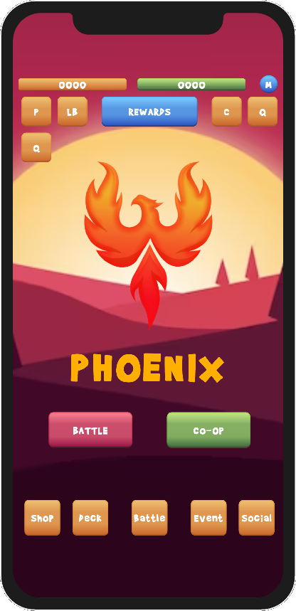
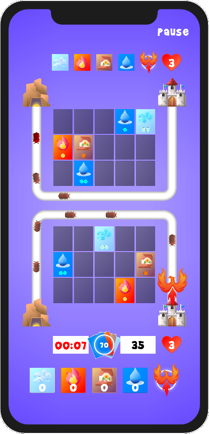

# BoardGame

Proje Açıklaması: Bu proje, Rumble Rivals, Random TD, Rush Royale gibi bir kule savunma oyunudur. Oyuncular, dalgalar halinde gelen düşmanlara karşı element kartlarını yerleştirir ve stratejik hamleler yaparak onları durdurmaya çalışır.

## Roadmap

Bu roadmap, projenin gelecekteki gelişimini planlamak için kullanılan bir rehberdir. Aşağıda, önümüzdeki aylar için bazı önemli kilometre taşları ve planlanan özellikler bulunmaktadır:

### Haziran 2023

- Yeni bir kaç düşman türü: Büyülü yaratıklar
- Yeni bir kaç BOSS türü 
- 4 adet oyuncu ana karakteri ve bunların özel saldırıları: Phoenix, Pegasus, Hidra, UNicorn
- Oyun içi kart satın alma sistemi entegrasyonu

### Ağustos 2023

- Yeni kule seçenekleri: Magma, Buhar, Volkan, Tornado
- Yeni bir oyun modu: CoOp mücadele
- Kullanıcı arayüzünü iyileştirme oyun performansını artırma

### Eylül 2023

- Yeni bir kaç BOSS
- Yeni bir kaç harita

## Nasıl Katkıda Bulunulur

Eğer projemize katkıda bulunmak isterseniz, aşağıdaki adımları izleyebilirsiniz:

1. Bu depoyu forklayın (https://github.com/nakrekarpay1245/BoardGame/fork)
2. Kendi bilgisayarınıza klonlayın: `git clone https://github.com/nakrekarpay1245/BoardGame.git`
3. Yeni bir dal oluşturun: `git checkout -b ozellik/desifre-edici-ozellik`
4. Değişikliklerinizi yapın ve bunları taahhüt edin: `git commit -am 'Özelliği ekle: Desifre edici özelliği'`
5. Dalınıza itin: `git push origin ozellik/desifre-edici-ozellik`
6. Bir Pull İsteği gönderin

---

© 2023 BoardGame. Tüm hakları saklıdır.
